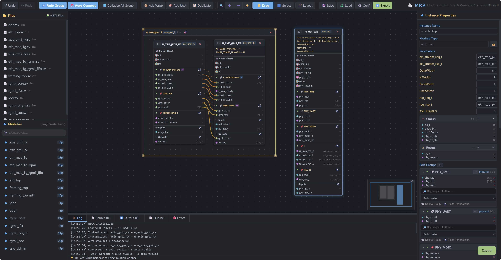
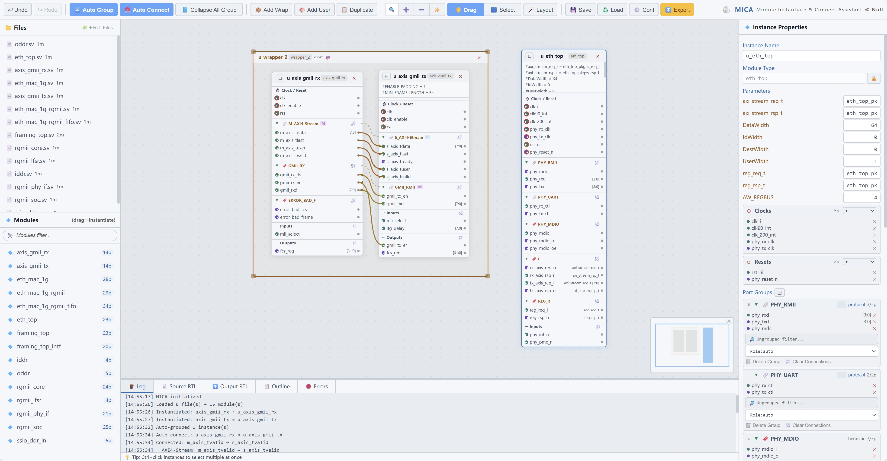

<h1 align="center">MICA</h1>

<strong>M</strong>odule <strong>I</strong>nstantiate &amp; <strong>C</strong>onnect <strong>A</strong>ssistant

  
  

<video src="doc/mica.mp4" controls></video>

---

A lightweight, browser-based Verilog/SystemVerilog integration platform. Drag-and-drop module instantiation, intelligent signal grouping, automatic connectivity inference, and one-click export — all in a single HTML file. No backend, no install, no setup.

## ✨ Features

- **🖱️ Drag-and-Drop Instantiation** — Drag modules from the sidebar onto the canvas to instantiate them. Resize, reposition, and organize instances freely.

- **🧠 Intelligent Auto-Grouping** — Heuristic port grouping with protocol-aware detection (AXI, APB, AHB, Wishbone, etc.). Ports are automatically clustered by prefix/suffix patterns, bus channel roles, and semantic similarity.

- **⚡ One-Click Auto-Connect** — Select two instances and click Auto Connect. MICA infers connections by port name, prefix/suffix matching, and protocol role inference (master ↔ slave).

- **🔀 Bus Connection Visualization** — Drag a group header from one instance to another to bulk-connect all ports. Interactive waypoint routing with drag-to-continue and right-click-to-delete.

- **📦 Wrapper / Sub-Module Creation** — Select instances and wrap them into a hierarchical sub-module. Wrappers are rendered as collapsible containers with port passthrough.

- **🧩 User-Defined Modules** — Create custom modules with arbitrary ports on the fly. Drop ports onto existing connections to splice modules inline.

- **📤 Multi-Format Export** — Export to a single Verilog file or ZIP package (per-module `.v` files). Configurable top-level port naming (instance-based, hierarchical, or custom prefix).

- **🎨 Dark & Light Themes** — Full light/dark theme support with persistent configuration. Syntax highlighting (One Dark / One Light) for RTL source viewing.

- **📑 Outline Panel** — Hierarchical tree view of all instances, wrappers, and connections. Click to navigate, expand/collapse wrappers.

- **↩️ Undo / Redo** — Full undo/redo stack for all operations: instance creation, deletion, movement, connection, grouping, and wrapper changes.

- **🗺️ Minimap** — Live preview minimap with connected-port indicators. Click to navigate.

- **💾 Save / Load** — Export and restore entire workspace as JSON.

- **🔍 Source RTL Viewer** — Click any module to view its original RTL source with syntax highlighting (Prism.js, SystemVerilog/Verilog grammar). Full-text search across loaded files.

- **⚙️ Configurable** — Tune grouping thresholds (tight/loose/noise), channel-aware splitting, density & layout ratio, custom protocol definitions.

- **📋 Tie Values** — Set unconnected input ports to `0`, `1`, top-level, or user-defined values.

- **🔌 Multi-Select & Batch Operations** — Ctrl+click to select multiple instances or modules. Batch drag, auto-group, auto-connect.

- **🚀 Zero Dependencies** — Single-file HTML. Everything inlined: Prism.js, WebCola layout engine, fflate ZIP compression. Works offline after first load.

## 🚀 Quick Start

1. **Open `index.html`** in any modern browser (Chrome, Firefox, Edge, Safari).
2. **Click `+ RTL Files`** to load your Verilog/SystemVerilog source files.
3. **Drag modules** from the sidebar onto the canvas.
4. **Auto-group & auto-connect** or manually wire ports.
5. **Export** to Verilog.

That's it. No `npm install`, no server, no build step.

## 📸 Screenshots

| Dark Theme            | Light Theme             |
| --------------------- | ----------------------- |
|  |  |

> 🎬 **[Watch Demo Video](doc/mica.mp4)** — drag-and-drop workflow, auto-grouping, bus connections, and export.

## 🏗️ Architecture

| Component       | Description                                                              |
| --------------- | ------------------------------------------------------------------------ |
| `VerilogParser` | Parses Verilog/SV files, extracts module definitions, ports, parameters  |
| `PortGrouper`   | Protocol-aware + heuristic port grouping via label propagation & Louvain |
| `GridRouter`    | WebCola-powered edge routing with obstacle avoidance                     |
| `Instance`      | Canvas object: port groups, connections, position, wrapper hierarchy     |
| `Connection`    | Wire between two ports, supports waypoints and bus aggregation           |

## 🧪 Supported Constructs

- `module` / `endmodule` with ANSI and non-ANSI port declarations
- `input` / `output` / `inout` ports with `[width-1:0]` ranges
- `parameter` / `localparam` with default values
- `interface` with `modport` definitions
- Nested module declarations

## 📦 Third-Party

| Library                                                 | License | Purpose                     |
| ------------------------------------------------------- | ------- | --------------------------- |
| [Prism.js](https://prismjs.com/)                        | MIT     | RTL syntax highlighting     |
| [prism-themes](https://github.com/PrismJS/prism-themes) | MIT     | One Dark / One Light themes |
| [webcola](https://github.com/tgdwyer/WebCola)           | MIT     | Graph layout engine         |
| [fflate](https://github.com/101arrowz/fflate)           | MIT     | ZIP export compression      |

## 📄 License

MIT © 2026 NullDEATH☆

---

  Built with ❤️ for the hardware design community.

